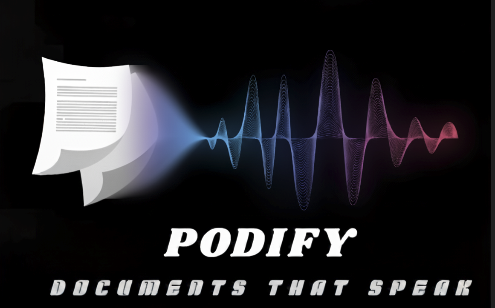
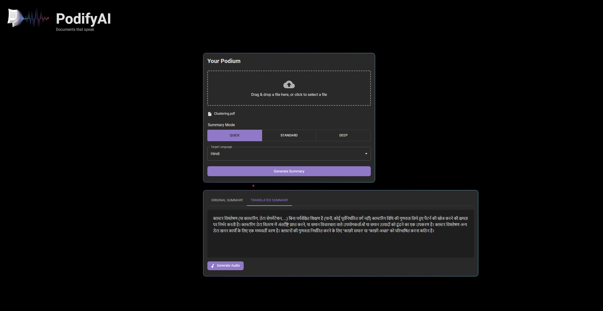
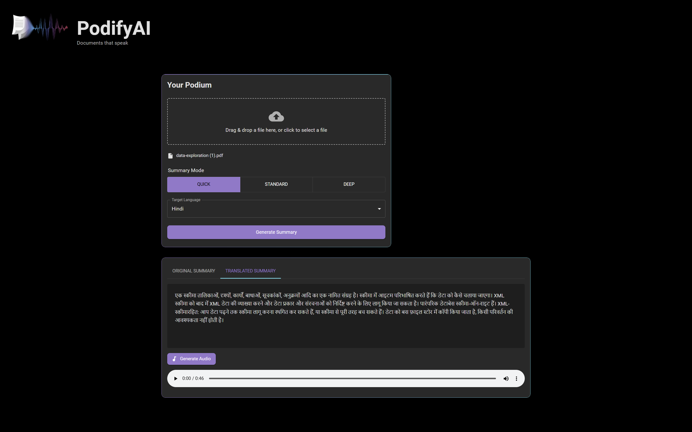

# PodifyAI: Document Summarization and Audio Generation

## Project Description and Purpose

PodifyAI is an innovative application designed to transform how users interact with documents by converting textual content into digestible summaries and spoken audio. My core purpose for this project is to provide an accessible and efficient tool for consuming information, particularly for long-form content. It caters specifically to individuals who are "on the go" and require quick access to key insights, for the visually impaired who cannot easily read traditional documents, and for those who encounter language barriers. By automatically summarizing documents and converting these summaries into spoken audio in multiple languages, PodifyAI aims to break down barriers to information consumption.

## Features

*   **Multi-format Document Upload:** Supports PDF, DOCX, PPTX, TXT, HTML, and CSV files via a user-friendly drag-and-drop interface.
*   **Abstractive Summarization:** Generates concise summaries using a pre-trained DistilBART model.
*   **Multilingual Translation:** Translates summaries into various target languages (e.g., Spanish, French, German).
*   **Text-to-Speech (TTS):** Converts translated summaries into audible MP3 files for convenient listening.
*   **Modern User Interface:** A sleek, dark-themed React frontend built with Material-UI, offering intuitive controls and visual feedback.

## User Interface

Here are some screenshots of the PodifyAI application in action:

### Application Logo


### Main Interface


### Summarization Results


### Audio Playback



## System Architecture

PodifyAI operates with a clear separation of concerns:
*   **Frontend:** A React.js application providing the user interface.
*   **Backend:** A Flask API orchestrating the machine learning pipeline.
*   **ML Pipeline:** Integrates pre-trained models for text extraction, summarization, translation, and TTS.

## Getting Started

Follow these instructions to set up and run PodifyAI locally.

### Prerequisites

*   Python 3.8+
*   Node.js and npm (or yarn)
*   Git

### 1. Clone the Repository

```bash
git clone [https://github.com/SainathChettupally/PodifyAI.git]
cd podifyai_deliverable_2 # or whatever your project folder is named
```

### 2. Backend Setup

Navigate to the project root and set up the Python environment:

```bash
# Create and activate a virtual environment
python -m venv venv
.\venv\Scripts\activate # On Windows
# source venv/bin/activate # On macOS/Linux

# Install backend dependencies
pip install -r requirements.txt

# Run the Flask backend API
python api.py
```
The backend will start on `http://localhost:5000`.

### 3. Frontend Setup

In a new terminal, navigate to the `frontend` directory:

```bash
cd frontend

# Install frontend dependencies
npm install

# Start the React development server
npm start
```
The frontend will open in your browser, typically at `http://localhost:3000`.

## Current Results and Known Issues

### Summarization Evaluation

A quantitative evaluation of the summarization pipeline was conducted using ROUGE scores against a subset of the CNN/DailyMail dataset.

*   **Average ROUGE-1 F-measure:** ~0.295
*   **Average ROUGE-2 F-measure:** ~0.126
*   **Average ROUGE-L F-measure:** ~0.208

These scores indicate that the model generates summaries with a moderate overlap with human-written references. Performance varies across different articles.

### Known Issues

*   **Summarizer Language Limitation:** The current DistilBART summarization model is English-centric. Summarizing documents in other languages (e.g., Hindi) directly will result in poor or nonsensical output. Translation occurs *after* summarization.
*   **No Document Pre-translation for Summarization:** The pipeline does not currently translate non-English documents *before* summarization. To summarize a non-English document effectively, it would first need to be translated to English.
*   **Qualitative Evaluation for Translation/TTS:** Formal quantitative evaluation for translation and Text-to-Speech components is pending; current assessment is primarily qualitative.

## Future Vision

My vision for PodifyAI's next iteration involves integrating the latest **Gemini models** via their API to unlock advanced multimodal and multilingual capabilities, significantly enhancing summarization quality, handling long-context documents, and improving overall user experience.

## Author

Sainath Chettupally

Email: s.chettupally@ufl.edu
